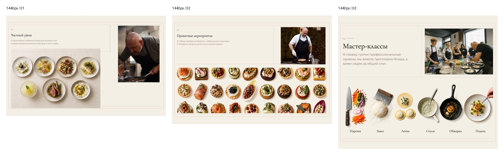
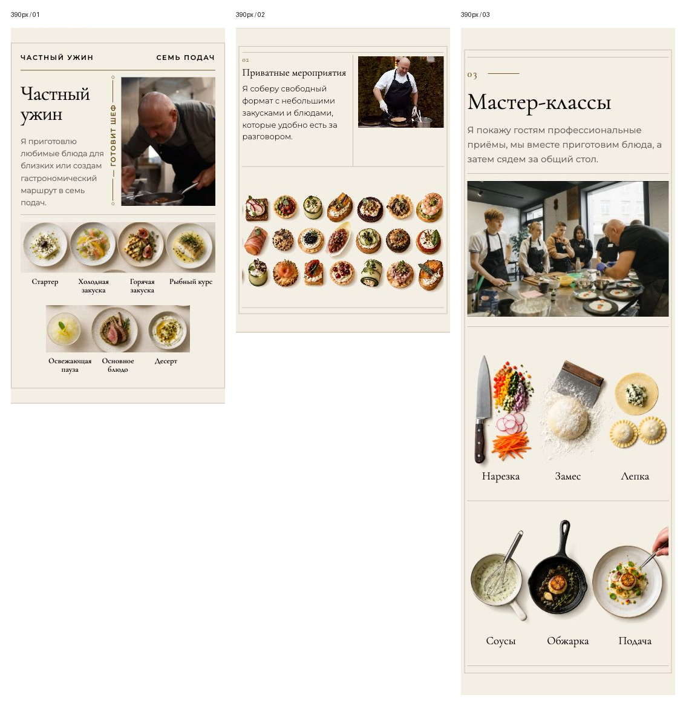

# Инспекция трёх форматов мероприятий — 10 сентября 2026

Запрос: «Частный ужин», «Приватные мероприятия» и «Мастер-классы» должны восприниматься как один формат, но выглядят по-разному.

Проверена актуальная локальная версия проекта на `http://localhost:5173/`: исходники, последние записи дизайн-системы и карты референсов, браузер при ширинах 1440, 1280, 1024, 768, 430, 390 и 375 px. Изменений интерфейса и публикации не было. Результаты относятся к локальной версии; полная проверка опубликованного сайта в эту инспекцию не входит.

**Вывод: замечание подтверждено.** Общие бумага, семейства шрифтов и тонкие рамки сохранились, но три услуги имеют разную визуальную иерархию, геометрию, оформление изображений и мобильное поведение. Мастер-классы воспринимаются отдельной крупной главой, мероприятия — более мелким вспомогательным блоком, ужин — самостоятельным меню-листом.

## Измерения в браузере

В каждой ячейке порядок: **ужин / мероприятия / мастер-классы**. Высота включает отступы соответствующего элемента `.format-row`; значения округлены. Разница высот сама по себе не является дефектом — здесь она показывает смену композиции и масштаба.

| Ширина, px | Заголовок, px | Описание, px | Высота блока, px | Переполнение страницы по горизонтали |
|---|---|---|---|---|
| 1440 | 28,8 / 28,8 / 60 | 15,1 / 15,1 / 25 | 819 / 885 / 1093 | Нет |
| 1280 | 25,6 / 25,6 / 55 | 14 / 14 / 24,3 | 734 / 792 / 976 | Нет |
| 1024 | 24 / 24 / 44 | 14 / 14 / 19,5 | 690 / 712 / 784 | Нет |
| 768 | 21,9 / 21,9 / 38 | 15,7 / 15,7 / 16 | 801 / 801 / 653 | Нет |
| 430 | 37,4 / 17 / 43 | 13,6 / 13 / 15 | 684 / 554 / 1187 | Нет |
| 390 | 33,9 / 17 / 39 | 13 / 13 / 15 | 620 / 503 / 1102 | Нет |
| 375 | 32,6 / 17 / 37,5 | 13 / 13 / 15 | 596 / 507 / 1070 | Нет |

Точные размеры элементов и состояние загрузки изображений: [metrics.json](../artifacts/event-formats-inspection-2026-09-10/metrics.json).

## Подтверждённые расхождения

1. **Высокий приоритет — типографика задаёт услугам разный статус.** На 1440 px заголовок мастер-классов более чем вдвое крупнее двух остальных, описание крупнее примерно в 1,65 раза. На 390 px заголовок мероприятий вдвое меньше заголовка ужина. Это различие размеров, а не только длины названий или переносов. Причина: независимые шкалы в `app/globals.css:3286`, `:3510`, `:3907`, `:4027`, `:4112`.

2. **Высокий приоритет — верх и низ построены по разным сеткам.** На широком экране ужин располагает небольшой текст сверху слева, семь тарелок в нижней левой зоне шириной 56% и высокий портрет справа шириной 26%. У мероприятий фото занимает 28%, а канапе идут широкой полосой снизу. Мастер-классы используют почти равные верхние колонки 1,1:1, затем общую нижнюю сцену. Получаются разные оси разделения, масштаб фотографий и распределение пустого пространства. Причина: `app/globals.css:3402`, `:3418`, `:3425`, `:3781`, `:3803`, `:3810`, `:3976`.

3. **Высокий приоритет — мобильная композиция меняется независимо.** Ужин и мероприятия сохраняют текст и фото рядом. Мастер-классы при ширине до 700 px идут в порядке «текст → фото на всю ширину → два ряда приёмов». На 390 px их блок имеет высоту около 1102 px против 620 и 503 px. У первых двух форматов основные пороги — 560, 820 и 1100 px. Следовательно, отношения между блоками меняются ещё и при переходе между устройствами. Причина: `app/globals.css:3494`, `:3528`, `:3890`, `:4080`.

4. **Средний приоритет — три системы служебного оформления.** На телефоне ужин скрывает `01`, показывает строку «ЧАСТНЫЙ УЖИН / СЕМЬ ПОДАЧ», золотую ось с точками и подписью «ГОТОВИТ ШЕФ». Мероприятия оставляют маленький `02` и нейтральные линии. Мастер-классы показывают более крупный `03` с короткой чертой. Внешние рамки имеют разные отступы от края, линии не образуют единого повторяемого правила. Причина: `app/page.tsx:302`, `:384`; `app/globals.css:3506`, `:3567`, `:3585`, `:3917`, `:4010`, `:4085`.

5. **Средний приоритет — изображения лежат на разных поверхностях и имеют разную плотность.** Семь подач остаются фотографией на видимом прямоугольном тканевом фоне. Канапе и приёмы мастер-класса имеют прозрачность и лежат на бумаге раздела. У ужина — семь предметов и на телефоне мелкие подписи; у мероприятий — плотное множество канапе без подписей; у мастер-классов — шесть крупных групп с заметными подписями. Разное содержание оправдано услугами, но масштаб, подложка и типографика подписей усиливают ощущение трёх разных оформлений. Ресурсы заданы в `app/page.tsx:91`, `:106`, `app/masterclasses-section.tsx:14`.

## Почему возникло расхождение

Это накопление отдельных локальных переработок. Первые два блока используют `.format-process-field` с абсолютными координатами и заданным отношением сторон. В `app/page.tsx:255` мастер-классы уходят в самостоятельный `MasterclassesSection`, использующий обычный поток и Grid.

История документации подтверждает отдельные требования:

- `docs/DESIGN_SYSTEM.md:1739`: отдельный лист мероприятий; соседним блокам сохранялась собственная визуальная грамматика.
- `docs/DESIGN_SYSTEM.md:1794`: отдельный мобильный лист ужина со служебной строкой и осью.
- `docs/DESIGN_SYSTEM.md:1883`: отдельная композиция мастер-классов и собственная шкала текста.
- `docs/DESIGN_SYSTEM.md:1897`: мастер-классам добавлены бумага и линии соседних блоков; типографика и структура сохранены.
- `docs/DESIGN_SYSTEM.md:1907`: мастер-классам задан отдельный мобильный переход при 700 px.
- Соответствующие источники зафиксированы в `docs/DESIGN_REFERENCE_MAP.md:1139`, `:1184`, `:1235`, `:1249`, `:1261`.

Поэтому одинаковый фон и рамки не решили проблему: они объединили лишь поверхность, оставив разные композиции.

## Основание для будущей унификации

Последнее прямое требование пользователя — три услуги в одном формате — задаёт общий принцип. Опорой служат уже существующие бумага, шрифты, редакционный лист и разделение «предложение + документальное фото + иллюстрация услуги». Новый внешний стиль не требуется.

Рекомендуется согласовать один каркас: одинаковую иерархию заголовка и описания, общие поля, способ оформления номера, систему рамок/разделителей, принцип верхней пары и общий мобильный переход. Содержимое нижней зоны остаётся различным: семь подач / канапе / шесть приёмов. Не следует принудительно уравнивать высоту блоков или заменять нижние зоны одинаковой сеткой карточек.

До изменения интерфейса необходимо записать общий контракт в `DESIGN_SYSTEM.md` и `DESIGN_REFERENCE_MAP.md`, явно обозначив, какие прежние локальные исключения он заменяет. Точные новые размеры, судьба служебной строки ужина, правила его тканевого фона и общий мобильный порядок пока не определены. Эта инспекция не выдаёт предложенные значения за утверждённые.

План возможной реализации: сохранить тексты, документальные фотографии и предметное содержание; вынести общую оболочку; переработать независимые шрифтовые шкалы, служебные элементы, координатную сетку и мобильные правила. Новые секции, маркетинговые тексты, иллюстрации или UI-библиотеки для этого не требуются.

## Проверка и ограничения

Композиции просмотрены на всех семи обязательных ширинах. Горизонтальное переполнение отсутствует; изображения загрузились. Текст остаётся внутри полей, но его иерархия и масштаб между блоками не согласованы. На 375 px название мероприятий переносится на две строки при сохранении малого кегля. Мобильные блюда ужина проверены также в обычном видимом окне браузера: все семь изображений присутствуют.

Начальные полностраничные снимки давали артефакт отрисовки скрытых до смены ширины полос блюд и фиксированной skip-ссылки. Итоговые снимки пересняты после просмотра полос и возврата к началу страницы; это не дефект контента и не внесённое исправление.

Шаблонные SaaS-карточки, произвольные градиенты, скругления и stock-темы библиотек в этих трёх блоках не выявлены. Основная проблема — распад единой системы из-за локальных исключений. Интерактивных форм и состояний отправки внутри блоков нет. Полный аудит контраста, клавиатуры, ошибок загрузки и остальной страницы не выполнялся.

`AGENTS.md` сохранён. Код интерфейса, действующие дизайн-документы, зависимости и публикация не изменялись. Созданы только этот отчёт и каталог доказательств. Унификация интерфейса остаётся невыполненной: текущий запрос был на инспекцию.

## Визуальные доказательства

Порядок в сравнениях: ужин / мероприятия / мастер-классы. В пределах каждого сравнения масштаб одинаковый; разная высота сохранена.

Остальные ширины: [1280](../artifacts/event-formats-inspection-2026-09-10/comparison-1280.png), [1024](../artifacts/event-formats-inspection-2026-09-10/comparison-1024.png), [768](../artifacts/event-formats-inspection-2026-09-10/comparison-768.png), [430](../artifacts/event-formats-inspection-2026-09-10/comparison-430.png), [375](../artifacts/event-formats-inspection-2026-09-10/comparison-375.png).
