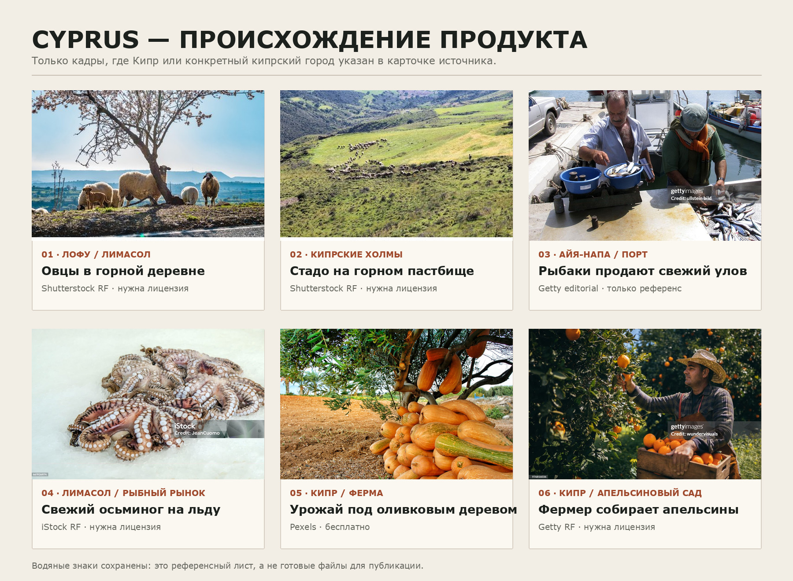
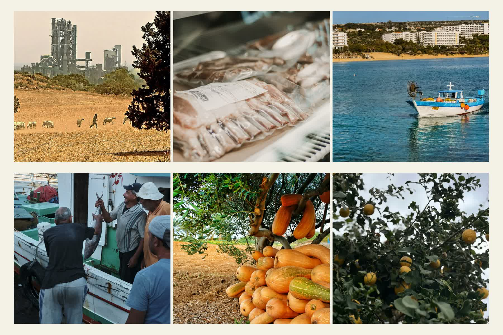
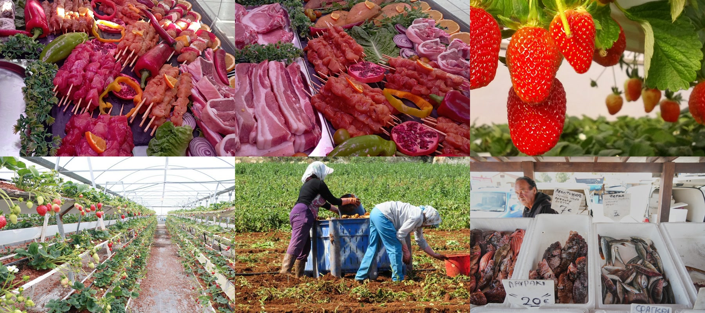

# Кипрские референсы: происхождение продуктов

Статус: **финальная семикадровая комбинация выбрана пользователем; три новых локальных кадра интегрируются с явно неурегулированными правами**
Дата проверки: 2026-08-31

Решение пользователя от 2026-08-31: для рыбного сюжета использовать рыбаков из порта Айя-Напы и представить их на сайте как местных героев/партнёров. Выбранная сцена — Getty 544225117. Разрешение изображённых рыбаков не заменяет разрешение правообладателя фотографии: до публикации нужен лицензированный файл без водяного знака и письменное разрешение Getty/фотографа на commercial/promotional use.

Коррекция пользователя от 2026-08-31: референсы с овощами, фруктами, рыбой и ягнёнком должны быть найдены и обновлены в публичном блоке. До получения платных файлов используется честная шестикадровая связка: кипрский маршрут + нейтральный продукт для ягнёнка и рыбы, затем отдельные кипрские кадры овощей и фруктов. Она не выдаёт нейтральные Pexels-фотографии за Кипр и не называет людей/хозяйства поставщиками Евгения.

Вторая коррекция пользователя от 2026-08-31: предыдущая связка не подходит. Для мяса нужен настоящий прилавок со свежим мясом в кипрском селе; для фермы — масштаб выращивания фруктов и овощей, приоритетно клубничная ферма; для рыбы — рынок непосредственно в гавани Ларнаки, где в одном сюжете читаются свежий улов и лодки. Эта коррекция отменяет прежнюю рекомендацию использовать нейтральное каре ягнёнка, отдельную лодку без рынка и декоративные кадры тыкв/лимонов как целевое визуальное решение.

Финальный выбор пользователя от 2026-08-31 уточняет, что часть существующей документальной линии нужно сохранить. Активная комбинация: овцы у Калавасоса плюс мясной прилавок Greenwood Family Butchers в Киссонерге; рыбаки с уловом плюс продавец рыбы в гавани Ларнаки; кипрский урожай тыкв плюс длинные ряды клубники в теплице. Отдельный кадр плывущей лодки удалён по последней прямой коррекции пользователя. Нейтральное каре ягнёнка, лодка и лимонный сад остаются в репозитории только как история источников. Пользователь прямо поручил добавить три выбранных референсных фотографии, однако это не означает подтверждение рекламных/коммерческих прав: Tripadvisor/platform, AP editorial и «Вестник Кипра» остаются release risk до письменного разрешения.

В подборке оставлены только фотографии, где **Cyprus**, **Republic of Cyprus** или конкретный кипрский город прямо указан в карточке источника. Удалены Испания, США и кадры с неподтверждённой географией. Кадры из Северного Кипра и дикие муфлоны не используются: они не подходят истории о закупке домашнего ягнёнка у кипрского хозяйства.

## Приоритетный лист после второй коррекции

| № | Сцена | Подтверждённая география | Источник | Статус прав и применение |
|---|---|---|---|---|
| 01 | Прилавок со свежим мясом и шашлычными заготовками | Киссонерга, деревня в районе Пафоса | [Greenwood Family Butchers — Tripadvisor](https://www.tripadvisor.com/Restaurant_Review-g1916666-d23825039-Reviews-Greenwood_Family_Butchers-Kissonerga_Paphos_District.html) | Пользовательская/площадочная фотография; **только референс**, запросить разрешение автора или владельца лавки |
| 02 | Крупный план того же прилавка с мясом на кости | Киссонерга, Кипр | [Greenwood Family Butchers — второй кадр](https://www.tripadvisor.com/Restaurant_Review-g1916666-d23825039-Reviews-Greenwood_Family_Butchers-Kissonerga_Paphos_District.html) | Та же серия; **только референс**, не публиковать без разрешения |
| 03 | Клубника на растениях в теплице | Деринья, Кипр | [Strawberry Festival in Deryneia — Cyprus Inform](https://www.kiprinform.com/en/cyprus_holidays/strawberry-festival-in-deryneia/) | Редакционная фотография; **только референс**, уточнить права у издания/автора |
| 04 | Длинные ряды гидропонной клубники | Кипр | [«Откуда родом кипрская клубника?» — «Вестник Кипра»](https://vkcyprus.com/interview/10715-otkuda-rodom-kiprskaya-klubnika/) | Редакционная фотография; **только референс**, запросить разрешение правообладателя |
| 05 | Ручной сбор картофеля на красной земле | Коккинохория, Кипр | [Kokkinochoria (Red Villages) — Cyprus Alive](https://www.cyprusalive.com/location/kokkinochoria-red-villages) | Права публикации не заявлены; **только референс**, запросить исходник и разрешение |
| 06 | Рыбный прилавок в гавани, лодки находятся сразу за продавцом | Ларнака, Кипр | [AP News, фото Petros Karadjias](https://apnews.com/article/cyprus-lionfish-toadfish-invasive-species-mediterranean-climate-b7a33b3f56d642171e54860706a67669) | AP editorial; **только композиционный референс**, для сайта нужна лицензия AP или собственная съёмка |

Выбранная шестикадровая связка использует № 01, № 04 и № 06 вместе с тремя сохранёнными файлами: овцы, рыбаки с уловом и тыквы. Одиночная лодка исключена последней коррекцией. Связка добавляется по прямому указанию пользователя, но не должна называться rights-cleared и не снимает необходимость получить разрешения до публичного коммерческого релиза.

## Короткий выбор

| Сюжет | Лучший референс | География | Права | Рекомендация |
|---|---|---|---|---|
| Ягнёнок в горах | [Овцы в горной деревне Лофу — Shutterstock 1030122331](https://www.shutterstock.com/image-photo/view-sheep-grazing-mountain-village-lofou-1030122331) | Lofou, Limassol, Cyprus | Stock / royalty-free, платно | **Основной выбор** |
| Рыба у рыбаков | [Рыбаки продают свежий улов — Getty 544225117](https://www.gettyimages.dk/detail/news-photo/zypern-fischer-verkaufen-fangfrischen-fisch-im-hafen-von-news-photo/544225117) | Agia Napa harbour, Republic of Cyprus | Editorial / rights-managed | **Выбрано пользователем; ожидается лицензированный файл и commercial clearance** |
| Рыба для коммерческого сайта | [Свежий осьминог на рыбном рынке Лимасола — iStock 661926974](https://www.istockphoto.com/photo/fresh-octopus-at-the-limassol-fish-market-gm661926974-120674647) | Limassol, Cyprus | Royalty-free, платно | Использовать как продуктовый крупный план рядом с портовым кадром |
| Фрукты с фермы | [Фермер собирает апельсины — Getty 976816036](https://www.gettyimages.pt/detail/foto/farm-worker-picking-ripe-oranges-from-orange-tree-imagem-royalty-free/976816036) | Republic of Cyprus | Creative royalty-free, model release, платно | **Основной выбор** |
| Овощи с фермы | [Урожай под оливковым деревом — Pexels 12635896](https://www.pexels.com/photo/mediterranean-yellow-zucchini-vegetables-in-a-field-cyprus-12635896/) | Cyprus | Pexels License, бесплатно | **Основной бесплатный выбор** |

## Публикуемый бесплатный набор

| Роль | Источник | Что подтверждает | Лицензия |
|---|---|---|---|
| Кипрский маршрут за ягнёнком | [Стадо с пастухом у Калавасоса — Wikimedia Commons 41810065242](https://commons.wikimedia.org/wiki/File:No_escape_(41810065242).jpg) | Республика Кипр, овцеводство и работа пастуха | CC BY 2.0; локальная WebP-копия |
| Продукт: ягнёнок | [Свежее каре ягнёнка — Pexels 29834284](https://www.pexels.com/photo/fresh-lamb-rack-in-pendleton-butcher-shop-display-29834284/) | Сам продукт, но не кипрскую географию и не поставщика | Pexels License; существующая локальная WebP-копия |
| Кипрский рыбный маршрут | [Рыбацкая лодка в Айя-Напе — PxHere 1371426](https://pxhere.com/en/photo/1371426) | Айя-Напу и местный рыболовный контекст | CC0; локальная WebP-копия |
| Работа с уловом | [Рыбаки с уловом — Pexels 17782837](https://www.pexels.com/photo/fishermen-with-catched-fish-on-boat-in-port-17782837/) | Рыбу и работу рыбаков, но не кипрскую географию и не партнёрство | Pexels License; существующая локальная WebP-копия |
| Овощи | [Урожай тыкв под оливковым деревом — Pexels 12635896](https://www.pexels.com/photo/mediterranean-yellow-zucchini-vegetables-in-a-field-cyprus-12635896/) | Овощной урожай на Кипре | Pexels License; локальная WebP-копия |
| Фрукты | [Лимонный сад на Кипре — Pexels 31092622](https://www.pexels.com/photo/lush-lemon-tree-in-cyprus-orchard-31092622/) | Фрукты и кипрский сад | Pexels License; локальная WebP-копия |

## 1. Ягнёнок в горах

### Основной кадр

[Овцы в горной деревне Лофу, Лимасол — Shutterstock, asset 1030122331](https://www.shutterstock.com/image-photo/view-sheep-grazing-mountain-village-lofou-1030122331)

- В карточке указаны Lofou, Limassol, Cyprus.
- В кадре одновременно читаются домашние овцы, горная линия и сухой кипрский ландшафт.
- Подходит для фразы «за ягнёнком еду в горы» и для широкого кропа на сайте.
- Перед публикацией нужна лицензия Shutterstock.

### Альтернатива с большим масштабом пастбища

[Стадо на холмах Кипра — Shutterstock, asset 1067240345](https://www.shutterstock.com/image-photo/herd-domestic-cattle-goats-sheep-feeding-1067240345)

- Карточка прямо говорит о ферме на Cyprus hills.
- Лучше показывает маршрут и масштаб хозяйства, но животные в кадре мельче.
- Использовать как панораму, а не как портрет ягнёнка.

### Вариант «уже разделано»

Точного коммерчески лицензируемого кадра **сырого разделанного ягнёнка, снятого на Кипре**, в проверенной выдаче не найдено. Существующий файл `lamb-rack-market.webp` снят в США и исключён из Cyprus-only линии.

Для строгой кипрской истории нужен один из вариантов:

1. собственная съёмка у реального кипрского мясника или поставщика;
2. покупка нейтрального крупного плана отруба без утверждения, что он снят на Кипре;
3. оставить только горный кадр, а переход к продукту показать уже в руках шефа.

## 2. Рыба в порту у рыбаков

### Самое точное совпадение сюжета

[Рыбаки продают свежий улов в порту Айя-Напы — Getty Images, 544225117](https://www.gettyimages.dk/detail/news-photo/zypern-fischer-verkaufen-fangfrischen-fisch-im-hafen-von-news-photo/544225117)

- В одном кадре есть рыбаки, свежая рыба, весы, лодки и порт.
- Getty указывает Agia Napa и Republic of Cyprus.
- Это editorial / rights-managed изображение без релиза; карточка требует связаться с Getty для любого коммерческого или рекламного использования.
- Поэтому кадр фиксирует **нужную постановку и композицию**, но не является безопасным финальным ассетом для сайта.

### Коммерчески лицензируемая связка

1. [Рыбак на лодке у побережья Айя-Напы — Shutterstock, asset 1980879524](https://www.shutterstock.com/image-photo/fisherman-on-his-boat-coast-near-1980879524) — точная кипрская локация, stock photo, платная лицензия; хорошо даёт море и реального рыбака, но улов виден слабо.
2. [Свежий осьминог на рыбном рынке Лимасола — iStock, 661926974](https://www.istockphoto.com/photo/fresh-octopus-at-the-limassol-fish-market-gm661926974-120674647) — точный продуктовый план, Cyprus указан в карточке, royalty-free.
3. [Свежий улов в руке рыбака в старом порту Лимасола — Shutterstock, поисковая карточка](https://www.shutterstock.com/search/fishing-man-and-fresh-fish?page=25) — наиболее точный коммерческий кандидат; перед покупкой открыть индивидуальную карточку, зафиксировать asset ID и повторно проверить тип лицензии.

Лучший производственный вариант — снять реального рыбака шефа в Зиги, Ларнаке, Лимасоле, Пафосе или Айя-Напе в той же композиции, что Getty 544225117.

## 3. Фрукты и овощи на ферме

### Основной человеческий кадр

[Фермер собирает апельсины — Getty Images, creative 976816036](https://www.gettyimages.pt/detail/foto/farm-worker-picking-ripe-oranges-from-orange-tree-imagem-royalty-free/976816036)

- Getty указывает Republic of Cyprus, Creative royalty-free и наличие model release.
- В кадре есть работа, корзина, руки и продукт на дереве.
- Это самый сильный кадр для основного фермерского сюжета; нужна платная лицензия.

### Бесплатные точные кипрские кадры

- [Урожай под оливковым деревом — Michal Rosak / Pexels](https://www.pexels.com/photo/mediterranean-yellow-zucchini-vegetables-in-a-field-cyprus-12635896/) — Cyprus указан в карточке; бесплатное коммерческое использование по Pexels License.
- [Лимоны в кипрском саду — Natalia Shatkova / Pexels](https://www.pexels.com/photo/lush-lemon-tree-in-cyprus-orchard-31092622/) — карточка указывает Cyprus; хороший вертикальный дополнительный кадр.
- [Поле баклажанов на Кипре — Hannes Grobe / Wikimedia Commons](https://commons.wikimedia.org/wiki/File:Aubergine_field-cyprus_hg.jpg) — CC BY 3.0; файл уже есть в проекте.
- [Апельсины на дереве на Кипре — JanRehschuh / Wikimedia Commons](https://commons.wikimedia.org/wiki/File:%E2%80%9EOrange_Frucht_fruit_Cyprus_PICT8063.JPG) — CC BY-SA 3.0; файл уже есть в проекте.

## Предлагаемая последовательность на сайте

1. Лофу: овцы крупно, горная линия остаётся в фоне.
2. Айя-Напа или Лимасол: человек и порт как документальный переход.
3. Рыба или осьминог на льду: продукт уже выбран.
4. Кипрская ферма: собранные овощи под оливой.
5. Апельсиновый сад: фермер завершает историю происхождения продукта.

Не ставить живое животное и сырой отруб вплотную. Между ними нужен портрет шефа, текст о выборе продукта или отдельный этап закупки.

## Лицензии и подписи

- Watermarked-превью в референсном листе нельзя использовать на публичном сайте.
- Для Shutterstock, Getty и iStock необходимо купить нужную лицензию и сохранить подтверждение покупки.
- Editorial-кадр Getty 544225117 не использовать в рекламе без письменного разрешения на commercial/promotional use.
- Pexels разрешает бесплатное коммерческое использование по своей лицензии; атрибуцию всё равно стоит сохранить в `CREDITS.md`.
- Для Wikimedia Commons обязательны условия конкретной CC-лицензии и корректная атрибуция.
- Ни одна стоковая фотография не подтверждает, что изображённое хозяйство или рыбак является поставщиком шефа.
